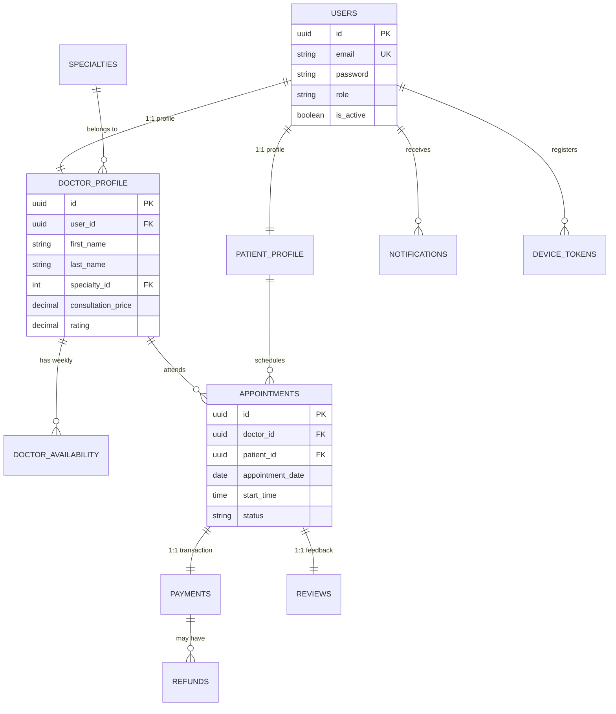

# 🗄️ Arquitectura de Datos - Vitalis Core

Este documento describe el diseño de la base de datos relacional de **Vitalis**, optimizada para PostgreSQL. El esquema utiliza características avanzadas para garantizar la integridad de los datos médicos y financieros.

---

## 📊 Diagrama Entidad-Relación (ERD)

---

## 🛡️ Características de Grado Empresarial

### 1. Robustez Matemática (GIST Indexes)
El motor de Vitalis utiliza extensiones de PostgreSQL para prevenir el solapamiento de citas.
- **`prevent_schedule_overlap`**: Un constraint tipo `EXCLUDE` basado en `gist` que asegura que ningún doctor tenga dos citas que se crucen en el mismo rango de tiempo. Esto garantiza la integridad sin depender únicamente de la lógica del backend.

### 2. Auditoría Automatizada (Triggers)
Cada tabla crítica (`users`, `appointments`, `payments`) cuenta con triggers de base de datos que actualizan automáticamente el campo `updated_at`. Esto asegura que los registros de auditoría sean 100% confiables para fines legales y de tracking.

### 3. Versionamiento con Flyway
La evolución de la base de datos se gestiona mediante migraciones SQL versionadas (`V1`, `V2`, `V3`). Esto permite:
- Despliegues reproducibles.
- Rollbacks seguros.
- Documentación implícita de cada cambio estructural.

---

## 🧩 Módulos del Sistema

### Capa de Identidad (Identity Layer)
- **`users`**: Almacena credenciales y roles.
- **`patient_profile` / `doctor_profile`**: Información específica de cada tipo de usuario, separada por el patrón de delegación para mayor limpieza.

### Motor Médico (Medical Engine)
- **`specialties`**: Catálogo de especialidades médicas.
- **`doctor_availability`**: Define la cuadrícula de trabajo semanal del médico.
- **`appointments`**: El núcleo del sistema, gestionando fechas, horas y estados (Pendiente, Confirmada, Completada).

### Capa Financiera (Financial Layer)
- **`payments`**: Registro de transacciones vinculadas a citas, con soporte para múltiples proveedores (Stripe por defecto).
- **`refunds`**: Gestión de reembolsos para citas canceladas.

### Engagement y Alertas
- **`notifications`**: Historial de alertas push y notificaciones in-app.
- **`reviews`**: Sistema de reputación donde pacientes califican a doctores (máximo 1 reseña por cita).

---

## 🚀 Optimización de Rendimiento
Se han implementado índices estratégicos para optimizar las consultas más frecuentes:
- `idx_appointments_doctor_date`: Búsqueda instantánea de la agenda de un doctor.
- `idx_notifications_user_unread`: Filtro ultra-rápido para la "campana" de notificaciones.

---

**Desarrollado por:** Jesus Guadalupe Canul Cua - Vitalis Healthcare 🚀
